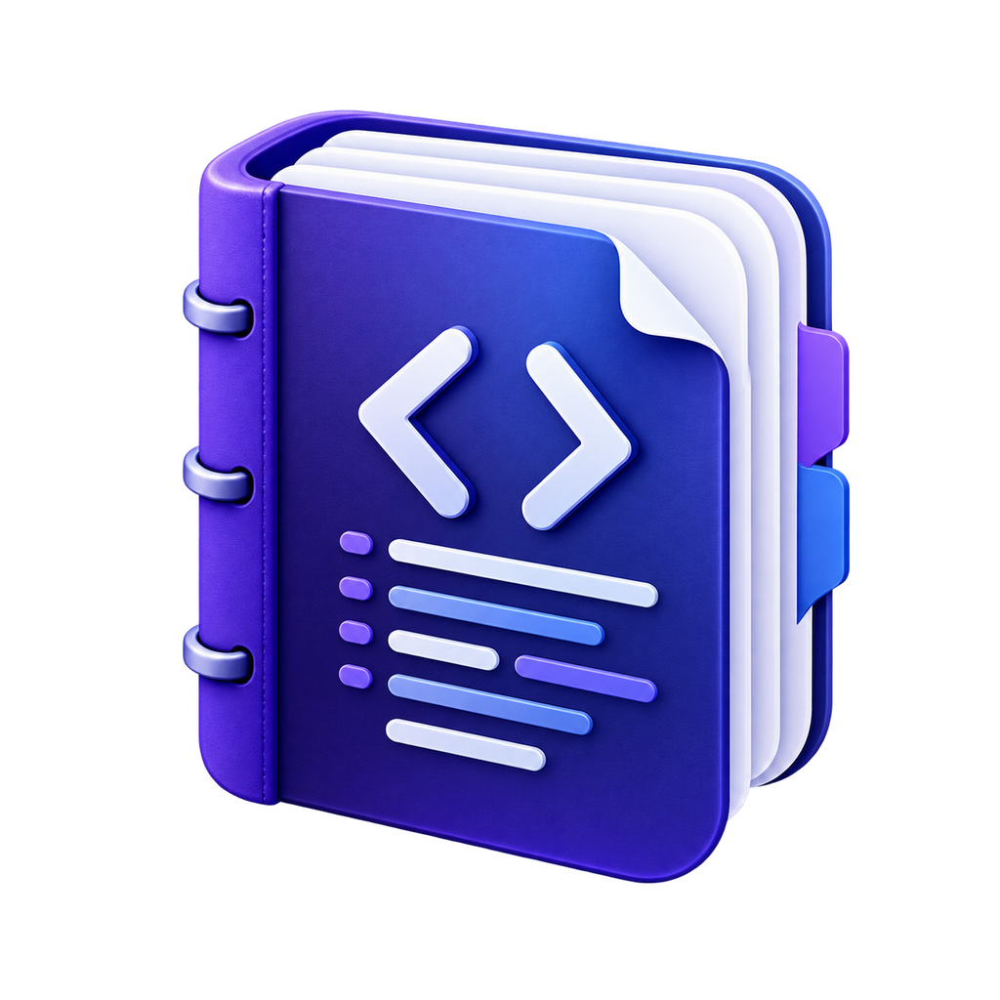

<div align="center">



# CodeDoc · 软著代码整理器

**一键生成软著代码审核材料**

全程离线 · 代码不出本机 · 规范内置 · 导出前自动校验

[](LICENSE)
[](#下载)
[](https://www.electronjs.org/)
[](#参与贡献)

</div>

---

## 为什么做这个

申请软件著作权登记时，需要提交**源程序鉴别材料**：前后各连续 30 页、每页不少于 50 行、页眉标注软件全称+版本号……格式细节繁多，一处不合就被退回补正。手工整理一次要花几个小时，而市面上的工具要么只做简单拼接、要么依赖在线服务（代码泄露风险）。

CodeDoc Generator 把繁琐的“软件著作权源程序材料”提交规则整理成一套本地流水线：导入项目 → 五步向导 → 导出 pdf 文档，并在导出前自动检查页数、每页行数、页眉、页脚、署名等格式是否符合中国版权保护中心要求，帮助减少手工整理错误与补正风险。

> [!IMPORTANT]
> **当前发布状态**
>
> 当前稳定版本为 **v1.0.2**。macOS arm64、macOS x64 和 Windows x64 安装包均已通过真实发布、公开下载和安装验收；macOS 应用内升级链路已经验证。
>
> GitHub Release 是当前默认发布与更新来源，阿里云 OSS 作为备选来源保留。开发与分发边界见 [docs/MAINTAINER_BASELINE.md](docs/MAINTAINER_BASELINE.md)。

当前桌面安全边界及维护要求见 [docs/SECURITY.md](docs/SECURITY.md)。

## 下载

请从 [GitHub Releases](https://github.com/littleben803/CodeSucker/releases) 获取正式版本。当前稳定版为 [v1.0.2](https://github.com/littleben803/CodeSucker/releases/tag/v1.0.2)：

| 平台 | 安装包 | 更新方式 |
|---|---|---|
| macOS Apple Silicon | [下载 DMG](https://github.com/littleben803/CodeSucker/releases/download/v1.0.2/CodeDoc-1.0.2-mac-arm64.dmg) | 支持应用内检查、下载和安装更新 |
| macOS Intel | [下载 DMG](https://github.com/littleben803/CodeSucker/releases/download/v1.0.2/CodeDoc-1.0.2-mac-x64.dmg) | 支持应用内检查、下载和安装更新 |
| Windows x64 | [下载 EXE](https://github.com/littleben803/CodeSucker/releases/download/v1.0.2/CodeDoc-1.0.2-win-x64.exe) | 支持发现新版本，更新时人工下载安装包 |

macOS 正式安装包已完成 Developer ID 签名、Apple 公证、staple 和 Gatekeeper 验证。Windows 安装包当前未做代码签名，安装时可能出现系统安全提示；请核对下载来源为本仓库的 GitHub Release。

## 功能特性

- 🗂 **目录级文件筛选** — 递归扫描项目并以真实目录树展示，支持目录三态选择、全选、清空和全局反选；设置页可维护所有项目共用的默认扫描排除规则，并与项目 `.gitignore` 独立叠加
- 🔄 **安全重新扫描** — 源码在应用外部变化后可手动重扫；保留当前项目配置与未保存修改，同时使旧处理、分页、校验和导出结果立即失效
- 📊 **文件类型构成与按后缀导出** — 按文件数/代码行查看完整与已选择构成，可一键只保留 `.java` 等指定后缀参与清洗和导出
- 🧹 **状态机代码清洗** — 逐字符识别注释与字符串边界（`"https://..."` 里的 `//` 不会被误删），支持 Java/Kotlin/Python/JS/TS/Go/Rust/C/C++/C#/Swift/PHP/Ruby/Vue/HTML/CSS/SQL 等 30+ 后缀；删空行、Tab 转空格、超长行按 78 列硬折断
- 🔒 **敏感信息脱敏** — API 密钥、密码、内网 IP、手机号自动替换为占位符
- 📄 **规范化截取分页** — 超 3600 行自动取前 1800 + 后 1800 行；第 1 页必为模块开头、第 60 页必为模块结尾；产品按每页 60 行显式分页，不靠排版"凑页"
- 📝 **一键导出** — PDF / docx（页眉=软件名+版本号、右上角自动页码、宋体 10.5pt、12pt 固定行距）+ txt 备查
- ✅ **提交前风险校验** — 检查有效内容、每页行数、末页 2/3、页眉一致性、首末页边界和 `@author`/`Copyright` 署名冲突，给出「通过 / 警告 / 退回风险」三级结论
- 🔐 **核心处理完全离线** — 扫描、清洗、排版和导出均在本机完成；macOS 正式安装版支持应用内版本更新
- 📌 **最近项目管理** — 常用项目可置顶，失效或不再使用的记录可单项或批量移除；移除记录不会删除磁盘项目
- 💾 **项目配置持久化** — 项目选择与配置信息会存入全局配置文件；应用级规则、最近打开项目和窗口状态都安全保存在本机持久化文件中

## 内置整理规则对照

| 规范要求 | CodeDoc Generator 的实现 |
|---|---|
| 前、后各连续 30 页，共 60 页 | 超 3600 行自动截取前 1800 + 后 1800 行 |
| 每页不少于 50 行 | 产品按 60 行切块 + 显式分页符，逐页保证 |
| 页眉标注软件全称+版本号 | 导出时写入页眉，未含版本号会在校验中警告 |
| 页角标注著作权人名称 | 导出时写入页脚，未含著作权人名称会在校验中警告 |
| 页码 1–60 连续 | PDF PAGE 域自动编号 |
| 第 1 页为程序开头、第 60 页为结尾 | 截取策略从首文件首行起、至末文件末行止 |
| 无空行、注释不凑页 | 清洗阶段删除（可关闭） |
| 末页至少满 2/3 | 校验器检查并提示 |
| 署名与著作权人一致 | 全文扫描 `@author`/`Copyright` 并比对 |

> 依据：[《计算机软件著作权登记办法》](https://www.ncac.gov.cn/xxfb/flfg/bmgz/202410/P020241015604759788122.pdf)及中国版权保护中心公开审查口径。本工具不构成法律建议，最终以登记机构要求为准。

## 从源码运行

### 开发运行

```bash
在项目根目录下运行
npm ci
npm run dev        # 启动桌面应用
npm test           # core 流水线冒烟测试
npm run verify     # 版本一致性 + 测试 + 完整校验
```

> **国内网络提示**：Electron 二进制下载失败时执行
> `ELECTRON_MIRROR=https://npmmirror.com/mirrors/electron/ node node_modules/electron/install.js`

### 使用流程

**① 导入项目**（拖入文件夹）→ **② 文件与排序**（勾选纳入、拖拽调序，入口文件置顶）→ **③ 清洗与排版**（填写软件全称+版本号、著作权人名称、清洗规则选择、实时清洗前后对比）→ **④ 分页预览**（PDF 预览、页码导航）→ **⑤ 校验与导出**（风险报告 + 生成 PDF/docx/txt）

## 架构

```
packages/
  core/     纯 TypeScript 流水线，零 Electron 依赖（未来可复用为 CLI / Web）
            discover → clean → select → render → audit
  app/      Electron 43 + React 18 + zustand（electron-vite 5 / Vite 7 构建）
design/
  prototype/  Claude Design 高保真原型（UI 实现基准）
  icon/       应用与官网共用的唯一品牌图标源（PNG）
  theme/      深色和浅色模式的高保真设计图和 UI 规范
docs/       功能设计、技术选型与原型 prompt
scripts/    图标生成、打包等工具脚本
ops/app-release/  CodeDoc 安装包归档、同步与发布记录
```

关键技术决策（详见 [docs/01-功能设计与技术选型.md](docs/01-功能设计与技术选型.md)）：

1. **显式分页而非排版凑页** — 分页符逐页控制，固定行距只作兜底，换字体不错位
2. **注释剥离用逐字符状态机而非正则** — 字符串字面量内的注释符号是正则流派的必错题
3. **截取锚定首末边界** — 首页从第一个入选文件开头开始，末页以最后一个入选文件结尾收束；前后段内部按行精确截取
4. **core 零壳依赖** — 业务全部沉在纯 TS 包，Electron 只做 IO 与窗口

## 常见问题

**Q：生成的文档能直接提交吗？**
生成的 PDF/docx 已按应用内置规则排版，可作为源程序鉴别材料的准备稿。提交前仍应查看第 5 步报告、清零「退回风险」，并以登记机构最新要求和申请主体的实际情况为准。本工具不构成法律建议。

**Q：我的代码会被上传吗？**
不会。扫描、清洗、排版和导出全部在本机完成，不会上传项目内容、路径或导出资料。正式安装版仅在检查和下载应用更新时访问所配置的发布来源。


## 版本与发布

CodeDoc Generator 使用 Semantic Versioning。根包、桌面应用、core 包和 lockfile 的产品版本由统一脚本同步；项目配置 schema 与合规规则版本独立演进。

```bash
npm run version:check                    # 检查所有版本字段一致
npm run version:set -- 1.0.3             # 统一设置下一个稳定版本
npm run verify                           # 发布前完整校验
npm run package:release                  # 交互构建并归档三平台发布候选包
npm run release:sync -- --provider github --channel stable --targets all            # 发布预演，不写入远端
```

正式同步还需要按预演输出提供 `--execute` 和完全匹配的 `--confirm` 确认字符串。本地发布打包、签名公证检查和三目标归档见 [docs/RELEASE_PACKAGING.md](docs/RELEASE_PACKAGING.md)，Provider 同步和故障恢复见 [docs/RELEASE_SYNC.md](docs/RELEASE_SYNC.md)。完整版本规则见 [docs/VERSIONING.md](docs/VERSIONING.md)，用户可见变化记录在 [docs/CHANGELOG.md](docs/CHANGELOG.md)。

## 参与贡献

欢迎 Issue 与 PR。提交前请确保 `npm run verify` 通过；提交信息请说明动机而不止是改动内容。

## 许可证

[Apache-2.0](LICENSE)

本项目允许使用、修改、分发及闭源商用；再分发时须附带 Apache-2.0 许可证、保留适用的版权与 [NOTICE](NOTICE) 声明，并标明对文件所作的修改。

安装包同时附带 [THIRD_PARTY_NOTICES.txt](THIRD_PARTY_NOTICES.txt)，列出实际分发与打入应用 bundle 的第三方依赖、许可证选择和完整归属文本。
